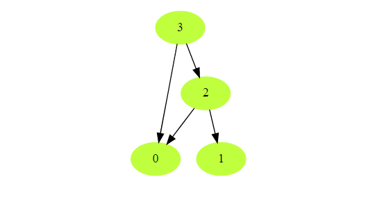

# 拓扑排序

## 背景
拓扑排序(Topological Sort)是为了在一堆有前后依赖关系的元素中，找到一条线性顺序，保证所有元素都能被访问到。比如你选课的时候，某些课程之间有限制（只能选了线代之后才能学高数），那么要找到一个合理的选课顺序就是典型的拓扑排序。

> Topological Sort of a directed graph (a graph with unidirectional edges) is a linear ordering of its vertices such that for every directed edge ```(U, V)``` from vertex ```U``` to vertex ```V```, ```U``` comes before ```V``` in the ordering.

Given a directed graph, find the topological ordering of its vertices.

示例1：

```shell
Input: Vertices=4, Edges=[3, 2], [3, 0], [2, 0], [2, 1]
Output: Following are the two valid topological sorts for the given graph:
1) 3, 2, 0, 1
2) 3, 2, 1, 0
```



## 伪代码
拓扑排序得用```BFS```去解

<font color=green>a. Initialization</font>

 where the ‘key’ will be the parent vertex number and the value 
To find the sources, we will keep a HashMap to count the in-degrees i.e., count of incoming edges of each vertex. Any vertex with ‘0’ in-degree will be a source.

<font color=green>b. Build the graph and find in-degrees of all vertices</font>

We will build the graph from the input and populate the in-degrees HashMap.

<font color=green>c. Find all sources</font>

All vertices with ‘0’ in-degrees will be our sources and we will store them in a Queue.


<font color=green>d. Sort</font>

For each source, do the following things:
Add it to the sorted list.
Get all of its children from the graph.
Decrement the in-degree of each child by 1.
If a child’s in-degree becomes ‘0’, add it to the sources Queue.
Repeat step 1, until the source Queue is empty.

## 模板

```cpp
class TopologicalSort {
 public:
  static vector<int> sort(int vertices, const vector<vector<int>>& edges) {
    vector<int> sortedOrder;
    if (vertices <= 0) {
      return sortedOrder;
    }

    // a. Initialize the graph
    unordered_map<int, int> inDegree;       // count of incoming edges for every vertex
    unordered_map<int, vector<int>> graph;  // adjacency list graph
    for (int i = 0; i < vertices; i++) {
      inDegree[i] = 0;
      graph[i] = vector<int>();
    }

    // b. Build the graph
    for (int i = 0; i < edges.size(); i++) {
      int parent = edges[i][0], child = edges[i][1];
      graph[parent].push_back(child);  // put the child into it's parent's list
      inDegree[child]++;               // increment child's inDegree
    }

    // c. Find all sources i.e., all vertices with 0 in-degrees
    queue<int> sources;
    for (auto entry : inDegree) {
      if (entry.second == 0) {
        sources.push(entry.first);
      }
    }

    // d. For each source, add it to the sortedOrder and subtract one from all of its children's
    // in-degrees if a child's in-degree becomes zero, add it to the sources queue
    while (!sources.empty()) {
      int vertex = sources.front();
      sources.pop();
      sortedOrder.push_back(vertex);
      vector<int> children =
          graph[vertex];  // get the node's children to decrement their in-degrees
      for (auto child : children) {
        inDegree[child]--;
        if (inDegree[child] == 0) {
          sources.push(child);
        }
      }
    }

    if (sortedOrder.size() !=
        vertices) {  // topological sort is not possible as the graph has a cycle
      return vector<int>();
    }

    return sortedOrder;
  }
};
```


