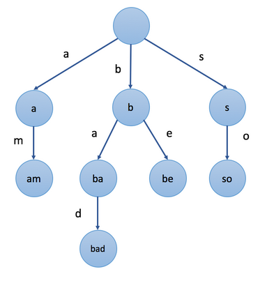

# 前缀树

## 背景

```前缀树```, 又称```字典树```, 是```N```叉树的一种。它是用来```存储字符串```的，前缀树的每一个节点代表一个 ```字符串（前缀）```。每一个节点会有多个子节点，通往不同子节点的路径上有着不同的字符。子节点代表的字符串是由节点本身的 ```原始字符串``` ，以及 ```通往该子节点路径上所有的字符``` 组成的。

示例：



节点的值是从根节点开始，与其经过的路径中的字符串按顺序组成。

前缀树的一个重要的特性是，节点所有的后代都与该节点相关的字符串有着共同的前缀，利用公共前缀来降低查询时间开销，这就是 ```前缀树``` 名称的由来。

前缀树有着广泛的应用，例如自动补全，拼写检查等等。

> 根节点是```空字符串```

## 表示

```前缀树```的特别在于字符和子节点之间的对应关系，怎样高效表示这种对应关系是重点。

- 数组
  - 假如只存储```a```到```z```的字符串，可以每个节点声明一个```26```维的数据保存子节点。
  - 对于特定字符```c```，使用```c-'a'```来作为索引查找数组中相应节点。
```cpp
// change this value to adapt to different cases
#define N 26

struct TrieNode {
    bool isEnd; //该节点是否是一个串的结束
    TrieNode* children[N];
    
    // you might need some extra values according to different cases
};

/** Usage:
 *  Initialization: TrieNode root = new TrieNode();
 *  Return a specific child node with char c: (root->children)[c - 'a']
 */
```

- Map
  - 使用```HashMap```存储子节点
  - 每个节点声明一个HashMap, 键是字符，值则是对应的子节点
```cpp
struct TrieNode {
    unordered_map<char, TrieNode*> children;
    
    // you might need some extra values according to different cases
};

/** Usage:
 *  Initialization: TrieNode root = new TrieNode();
 *  Return a specific child node with char c: (root->children)[c]
 */
```
> 通过相应的字符来访问特定的子节点 ```更为容易``` 。但它可能比使用数组 ```稍慢一些``` 。但是，由于我们只存储我们需要的子节点，因此 ```节省了空间``` 。这个方法也更加 ```灵活``` ，因为我们不受到```固定长度和固定范围```的限制。

> https://leetcode-cn.com/leetbook/read/trie/x7ke5m/


